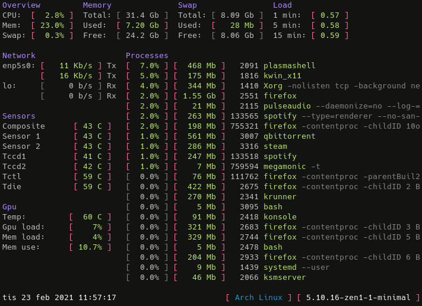

# megamonic
A badly designed multithreaded system monitor for 64bit linux for my personal use.

## Build instructions for 64bit Arch
I think this is what is needed but I'm not sure.

Other than Rust you need these packages.  
Requirements: `glibc`, `gcc-libs` and`lm_sensors`  
Optional GPU support: `nvidia-utils`  

1. git clone https://github.com/meganomic/megamonic.git
2. cargo b --release

### FAQ

Q: Why another performance monitor?  
A: For fun

Q: Why multithreaded?  
A: For fun

Q: <*insert your question*>  
A: For fun
